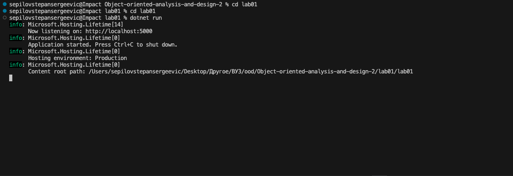
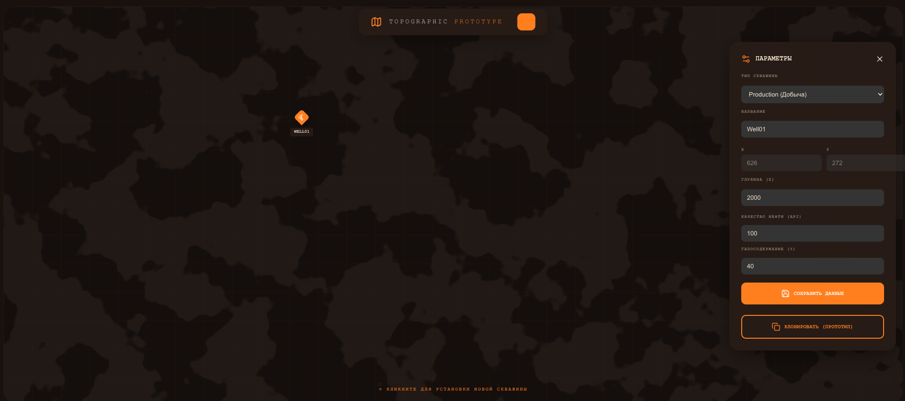

## Лабораторная работа 1

В данной лабораторной работе я применил паттерн прототип для решения проблемы копирования скважин на месторождении

Case: абстрактный геолог создает эталонную скважину какого-либо типа на карте месторождения, где в нашем приближении у одной скважины ~10 полей, которые надо заполнить, хочет её склонировать и расставить точно такие же на месторождении

Неудобство: каждый раз при создании заполнять все поля - боль, так как в реальных системах у скважин может быть и 100 параметров, при реализации без паттерна "Прототип" нам придется и заполнять эти поля, и передавать их с фронтенда по api

Решение: паттерн "Прототип", в данном случае мы применяем его для реализации функционала клонирования скважины со всеми её параметрами


Проект состоит из 2 частей - бизнес логика и api на C# и фронтенд на react

API запускается следующим образом

```bash
cd lab01
cd lab01
dotnet run

info: Microsoft.Hosting.Lifetime[14]
      Now listening on: http://localhost:5000
info: Microsoft.Hosting.Lifetime[0]
      Application started. Press Ctrl+C to shut down.
info: Microsoft.Hosting.Lifetime[0]
      Hosting environment: Production
info: Microsoft.Hosting.Lifetime[0]
      Content root path: /Users/sepilovstepansergeevic/Desktop/Другое/ВУЗ/ood/Object-oriented-analysis-and-design-2/lab01/lab01
```

Фронтенд поднимается следующим образом

```bash
cd lab01
cd ui

npm run dev

> ui@0.0.0 dev
> vite


  VITE v7.3.1  ready in 73 ms

  ➜  Local:   http://localhost:5173/
  ➜  Network: use --host to expose
  ➜  press h + enter to show help
```



