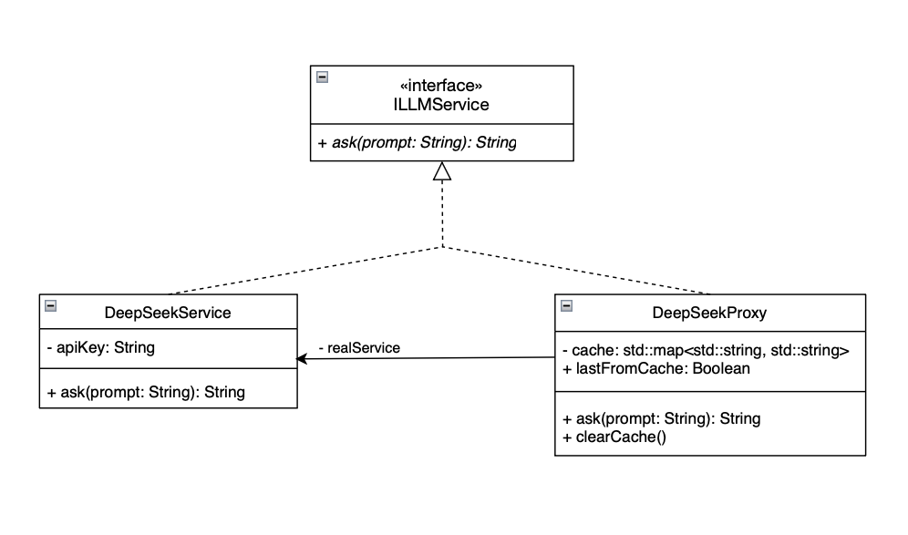

## Описание классов

- **`ILLMService`** – интерфейс, задающий метод `ask(prompt)` для всех сервисов.  
- **`DeepSeekService`** – реальный сервис, выполняет HTTP-запрос к API DeepSeek и возвращает ответ модели.  
- **`DeepSeekProxy`** – прокси-класс, содержащий ссылку на `DeepSeekService` и кэш (`std::map`). Перед вызовом реального сервиса проверяет наличие ответа в кэше; если есть – возвращает сохранённый результат, иначе вызывает реальный сервис и сохраняет ответ. Поле `lastFromCache` показывает источник последнего ответа, метод `clearCache()` очищает кэш.  
- **GUI (main)** – реализует окно ввода/вывода с помощью Dear ImGui, асинхронно вызывает методы прокси и отображает статус (кэш/сеть).

## Применение паттерна Proxy

Паттерн Proxy использован для создания **кэширующего заместителя**. Он перехватывает вызовы метода `ask()` и добавляет функциональность кэширования без изменения кода реального сервиса. Это позволяет:
- сократить время ответа при повторных запросах
- уменьшить количество сетевых обращений к API
- прозрачно для клиента расширить поведение объекта
- сэкономить мне деньги на одних и тех же запросах

## Инструкция по запуску проекта
```bash
cd lab02 & cd build
make
./DeepSeekProxy
```

<video controls src="images/Запись экрана 2026-03-05 в 13.52.47.mov" title="Демо"></video>