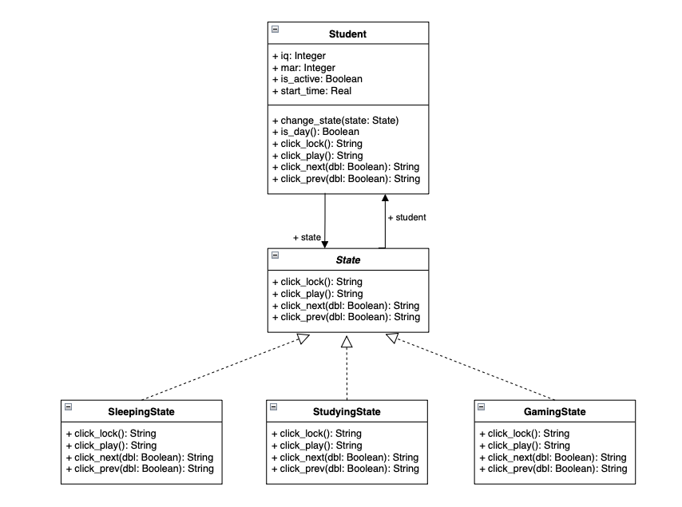
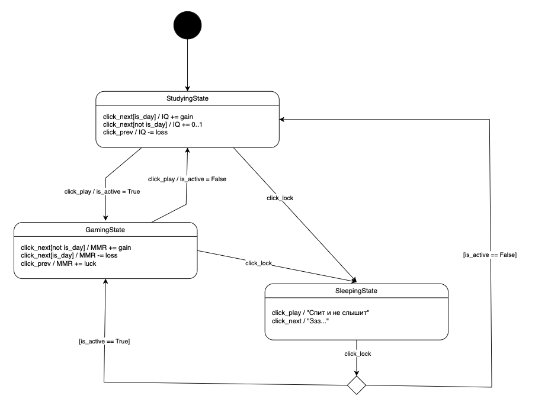

*   **Контекст (`Student`):** Хранит данные (IQ, MMR, время) и ссылку на объект текущего состояния. Делегирует выполнение всех действий (`click_next` и др.) активному состоянию.
*   **Интерфейс (`State`):** Абстрактный базовый класс, определяющий методы взаимодействия (кнопки управления).
*   **Конкретные состояния:**
    *   `SleepingState`: Студент игнорирует большинство действий.
    *   `StudyingState`: Повышает IQ. Эффективность выше днем.
    *   `GamingState`: Повышает MMR. Эффективность выше ночью.

*   `click_lock()`: Смена режима Сон ↔ Активность.
*   `click_play()`: Переключение между Учебой и Игрой.
*   `change_state()`: Метод контекста, который состояния вызывают сами, чтобы переключить «фазу» жизни студента.
